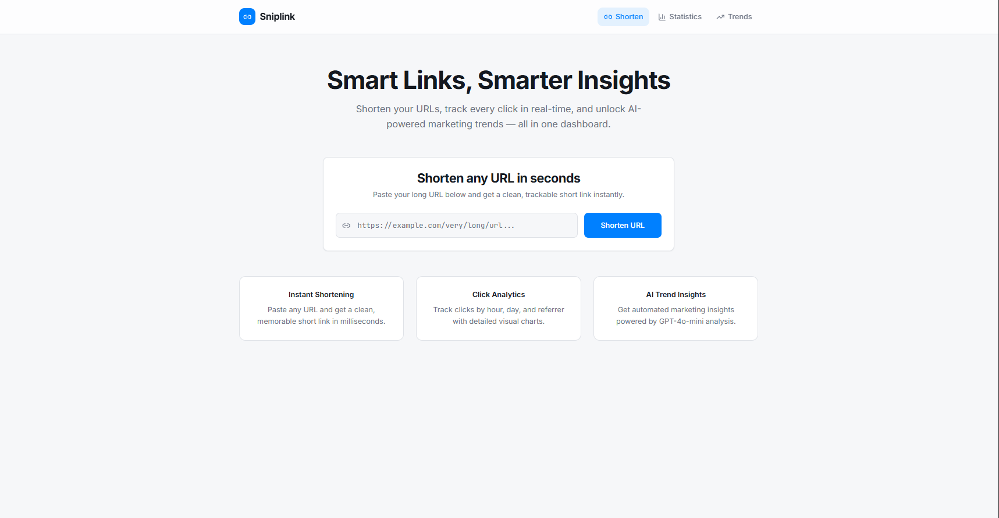
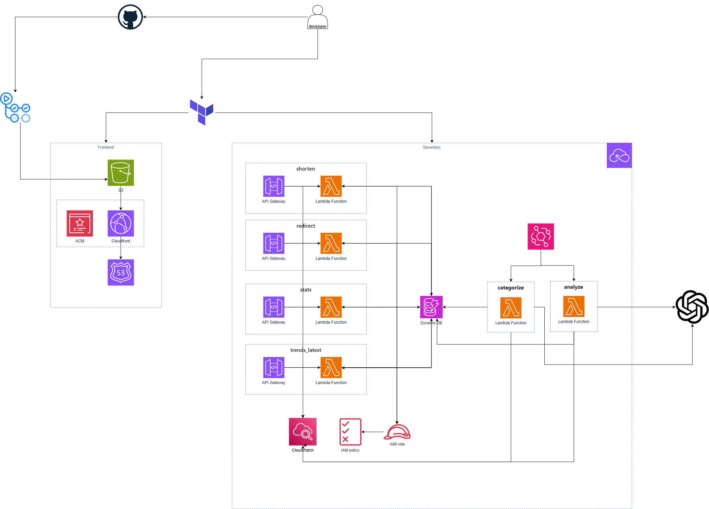
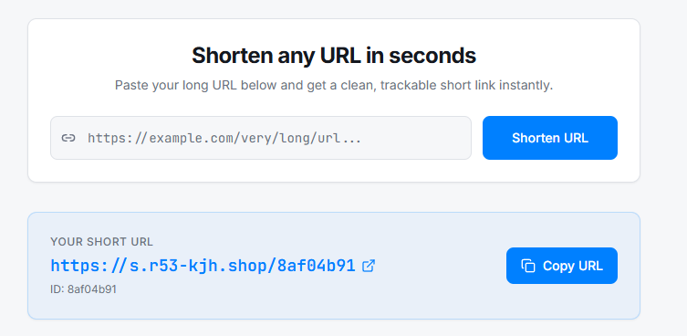
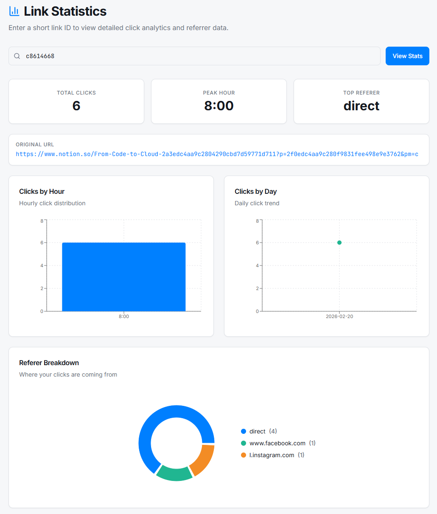
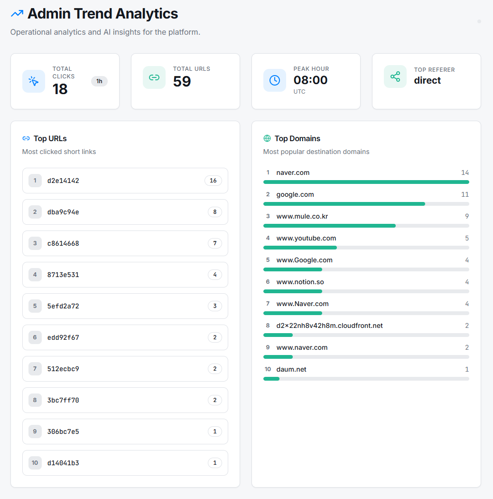
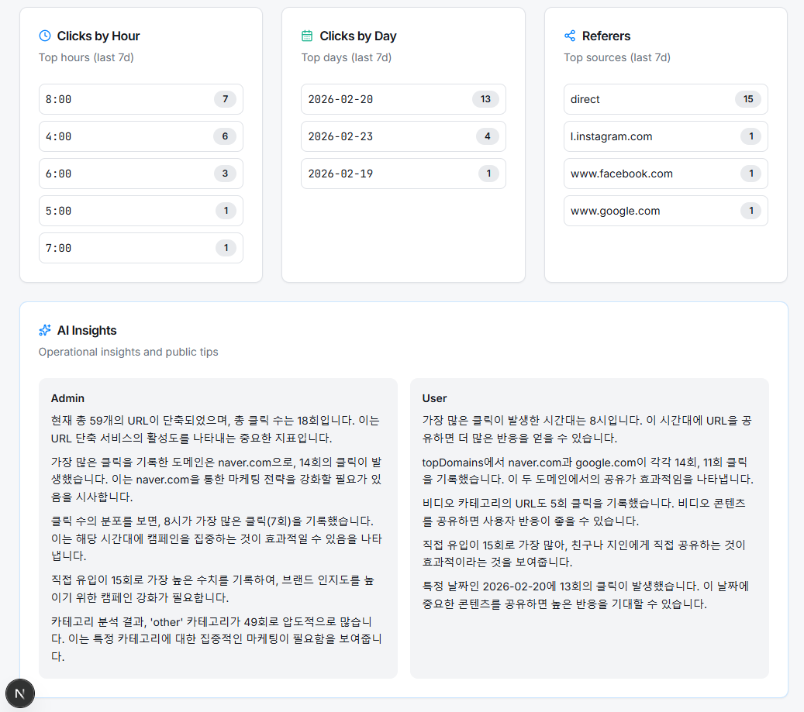
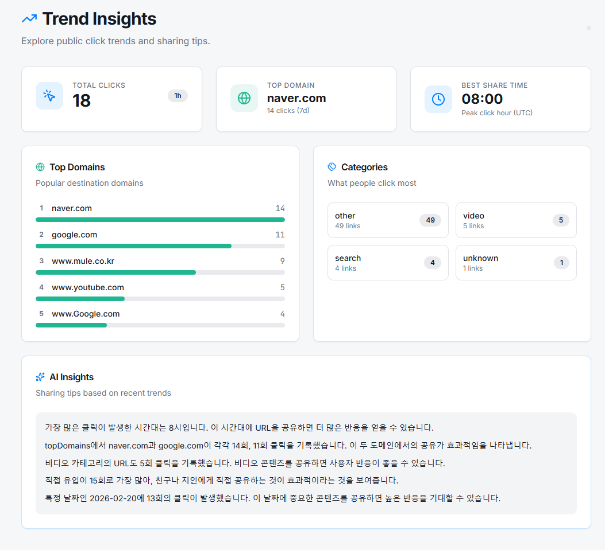
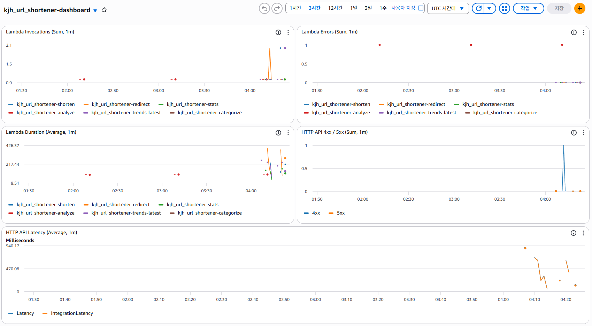
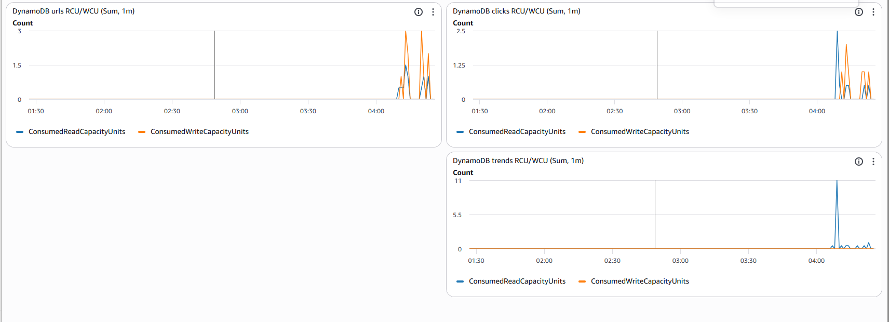

# 🔗 AI Trend Short

**서버리스 URL 단축 & AI 트렌드 분석 플랫폼**

단순한 URL Shortener를 넘어
클릭 데이터를 분석하고 AI 인사이트를 제공하는 서버리스 기반 트렌드 분석 서비스

**📌 프로젝트 한 줄 요약**

AWS Serverless 아키텍처 기반 URL 단축 서비스에
OpenAI 기반 AI 트렌드 분석 엔진을 결합한 데이터 분석 플랫폼

---
## 🏗️ Architecture

### 📦 Infrastructure (Terraform IaC)

* API Gateway
* AWS Lambda (shorten / redirect / stats / analyze / categorize)
* DynamoDB (urls / clicks / trends)
* EventBridge (1시간 주기 AI 분석 트리거)
* S3 + CloudFront (Frontend 정적 배포)
* IAM Role 최소 권한 설계
* CloudWatch Logs + Metric Alarm 모니터링 구성

모든 인프라는 Terraform 모듈화 구조로 관리됩니다.

```
modules/
 ├── acm
 ├── dynamodb
 ├── lambda
 ├── iam
 ├── apigw
 ├── scheduler
 ├── cloudfront
 ├── s3
 ├── route53
 └── monitoring
```
---
## 🚀 주요 기능
### 1️⃣ URL 생성 (shorten)

* 원본 URL 저장
* UUID 기반 8자리 shortId 생성
* DynamoDB 저장
* 초기 clickCount 0 설정

### 2️⃣ 리다이렉트 (redirect)

* shortId 조회
* 원본 URL 302 리다이렉트
* 클릭 로그 DynamoDB 저장
* clickCount 증가

### 3️⃣ 통계 API (stats)

* 최근 7일 클릭 분석
* 시간대별 클릭 분포
* 인기 URL 집계
* 도메인별 통계

### 4️⃣ AI 트렌드 분석 (analyze)
 


* EventBridge → 1시간마다 analyze Lambda 자동 실행

**분석 항목:**

* 📊 트래픽 피크 시간대
* 🌍 주요 유입 경로 분석
* 🔗 인기 URL 도메인 분석
* 💡 마케팅 인사이트 제안

OpenAI `gpt-4o-mini` 모델 활용

분석 결과는 `trends` 테이블에 저장 후 API로 제공

** 사용자/관리자 화면 분리 설계 **

| 구분      | 사용자 화면                         | 관리자 화면                                 |
| ------- | ------------------------------ | -------------------------------------- |
| 목적      | 공유 전략 제안                       | 운영 데이터 분석                              |
| 표시 데이터  | Best Share Time, 인기 도메인, 카테고리  | 시간대/일자/Referer 상세 통계                   |
| AI 인사이트 | 공유 팁 중심 (예: 최적 업로드 시간, 추천 플랫폼) | 운영 최적화 제안 중심 (예: 트래픽 이상 탐지, 마케팅 전략 개선) |


### 5️⃣ URL 카테고리 자동 분류 (categorize)

* 도메인 Rule 기반 1차 분류
* LLM 기반 보완 분류
* DynamoDB 업데이트
---
## 🧠 설계 의도
###  ✅ 서버리스 아키텍처 선택 이유

* 트래픽 예측이 어려운 서비스 특성
* 초기 비용 최소화
* 자동 확장 (Auto Scaling)
* 서버 관리 부담 제거

### ✅ AI 분석 비동기 구조 설계

* 사용자 요청과 AI 분석 분리
* EventBridge 기반 주기 실행
* 사용자 응답 지연 최소화
* 결과는 trends 테이블에 캐싱

### ✅ 모니터링 설계
 

* Lambda 에러 로그 수집
* DynamoDB RCU/WCU 모니터링
* API Gateway 요청 수 추적
* CloudWatch Alarm 기반 장애 감지
---

## 🛠 기술 스택
| 구분     | 기술   |
| --------- | ------ | 
| 🐍 Backend | Python3 (AWS Lambda)     | 
| 🗄 Database| AWS DynamoDB | 
| ☁️ Cloud | AWS (S3, CloudFront, API Gateway, EventBridge) | 
| 📊 Monitoring | CloudWatch (Logs, Metrics, Alarms) | 
| 🤖 AI | OpenAI API | 
| 🏗 IaC | Terraform| 
| 🌐 Frontend | Next.js 14 (React, TypeScript) | 
| 🔄 CI/CD | GitHub Actions, Terraform Cloud | 

---

## 📊 데이터 모델
**urls**
| 필드                 | 타입     | 설명                                                                  |
| ------------------ | ------ | ------------------------------------------------------------------- |
| shortId            | string | 단축 코드 (예: a1b2c3d4)                                                 |
| originalUrl        | string | 원본 URL                                                              |
| title              | string | (선택) URL 제목                                                         |
| category           | string | 분류된 카테고리 값 (예: news, shopping, blog, community, docs, video, sns 등) |
| categoryConfidence | number | 카테고리 추정 신뢰도 (0~1 또는 0~100, 프로젝트 기준)                                 |
| categoryReason     | string | 해당 카테고리로 판단한 근거 요약 (도메인, path 키워드 등)                                |
| categorySource     | string | 카테고리 산출 방식 (ai / rule / manual)                                     |
| categorizedAt      | string | URL 카테고리 분류 수행 시각 (ISO8601, UTC). 미분류 시 NULL 가능                     |
| createdAt          | string | URL 생성 시각 (ISO8601, UTC)                                            |
| clickCount         | number | 누적 클릭 수                                                             |

**clicks**
| 필드        | 타입     | 설명                                                   |
| --------- | ------ | ---------------------------------------------------- |
| shortId   | string | 단축 코드                                                |
| timestamp | string | 클릭 발생 시각 (ISO8601, UTC)                              |
| referer   | string | 유입 경로 도메인 또는 `direct`                                |
| userAgent | string | (선택) User-Agent 정보                                   |
| ip        | string | 요청 IP (X-Forwarded-For 기반). 개인정보 보호를 위해 마스킹/해시 저장 가능 |


**trends**
| 필드          | 타입         | 설명                                                                  |
| ----------- | ---------- | ------------------------------------------------------------------- |
| period      | string     | 집계 기간 키 (예: 1h, 24h, 7d)                                            |
| generatedAt | string     | 분석 생성 시각 (ISO8601, UTC)                                             |
| model       | string     | 분석에 사용된 모델 식별자 (예: gpt-4o-mini)                                     |
| totalClicks | number     | 해당 period 내 총 클릭 수                                                  |
| totalUrls   | number     | 해당 period 내 분석 대상 URL 개수                                            |
| stats       | map (JSON) | 분석에 사용된 원천 통계 (예: topUrls, topDomains, clicksByReferer, peakHour 등) |
| insights    | map (JSON) | AI가 생성한 인사이트 결과 (요약, 마케팅 제안, 최적 공유 시간대, 이상 징후 등)                    |


---

## 🔥 DevOps 구성

* Terraform 모듈화 구조
* 환경 변수 기반 테이블 분리
* Lambda 환경 변수 관리
* 아키텍처(x86_64) 이슈 대응 경험
* CloudFront + API Gateway 도메인 분리 설계
* CloudWatch 기반 운영 모니터링
---
## 🧪 트러블슈팅 경험

* DynamoDB Decimal → JSON 직렬화 문제 해결
* Lambda pydantic import 오류 해결
* ARM/x86 아키텍처 충돌 해결
* API Gateway 커스텀 도메인 미설정 이슈 분석
* CloudFront 캐시 관련 문제 해결
---
## 📈 향후 개선 방향

* Cognito 기반 관리자 인증
* AWS WAF 적용
* AI 분석 고도화 (요일/시간 예측 모델)
* 실시간 분석 파이프라인 (Kinesis)
* 사용자 대시보드 UX 개선
---
## 🎯 프로젝트 의의

* 이 프로젝트는 단순한 URL 단축 서비스 구현을 넘어 서버리스 아키텍처 설계
* AI 분석 파이프라인 구축
* Terraform 기반 IaC
* 모니터링 및 운영 설계
* 실제 배포 및 도메인 연결

까지 포함한 **End-to-End 클라우드 프로젝트**입니다.

## 🚀 Getting Started
### 1️⃣ Prerequisites

* Terraform >= 1.5
* AWS CLI
* Node.js 18+
* AWS 계정
* OpenAI API Key
---
### 2️⃣ AWS 인증 설정
```Bash
aws configure
```
---
### 3️⃣ Infrastructure 배포 (Terraform)
```Bash
cd Terraform
terraform init
terraform apply
```
필요 시 `terraform.tfvars` 설정:
```hcl
openai_api_key = "yout_api_key"
frontend_domain = "short.yourdomain.com"
root_domain = "yourdomain.com"
BASE_URL = "https://s.yourdomain.com"
```
4️⃣ Frontend 실행 (로컬)
```Bash
cd frontend
npm install
npm run dev
```
`.env.local` 설정:
```env
NEXT_PUBLIC_API_BASE=https://your-api-id.execute-api.ap-northeast-2.amazonaws.com
```
---

5️⃣ 리소스 삭제
```Bash
terraform destroy
```
---
📌 실행 순서 요약
```Bash
aws configure
cd Terraform
terraform init
terraform apply
cd frontend
npm install
npm run dev
```
